# Практическая работа №5: Работа с несколькими окнами (Activity)

**Выполнил:**  
Саньков Андрей Александрович  
Группа: ИНС-б-о-24-1  
Направление: 09.03.02 «Информационные системы и технологии»

---

## Цель работы

Научиться создавать многоэкранные приложения, осуществлять навигацию между активностями (Activity) и передавать данные между ними с использованием объектов `Intent` и механизма `startActivityForResult` / `onActivityResult`.


## Ход работы

### Задание 1. Создание главной Activity (MainActivity)

Создан новый проект MultiWindowLab с шаблоном Empty Views Activity. В файле activity_main.xml размещены:
- TextView с заголовком;
- две кнопки: «Настройки» и «Об авторе»;
- TextView для отображения результата настроек.

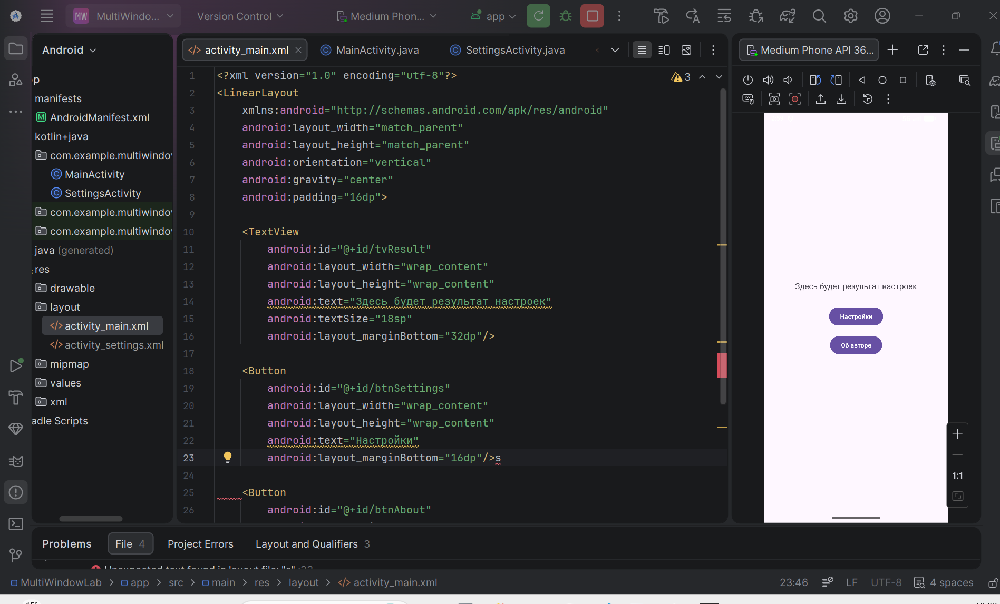

**Рисунок 1** — Интерфейс MainActivity

---

### Задание 2. Создание Activity «Настройки» (SettingsActivity)

Создана новая Activity через мастер: SettingsActivity с разметкой activity_settings.xml. В разметке размещены три RadioButton (красный, зелёный, синий) и кнопка «Сохранить». В коде SettingsActivity реализована отправка результата обратно в MainActivity через setResult().

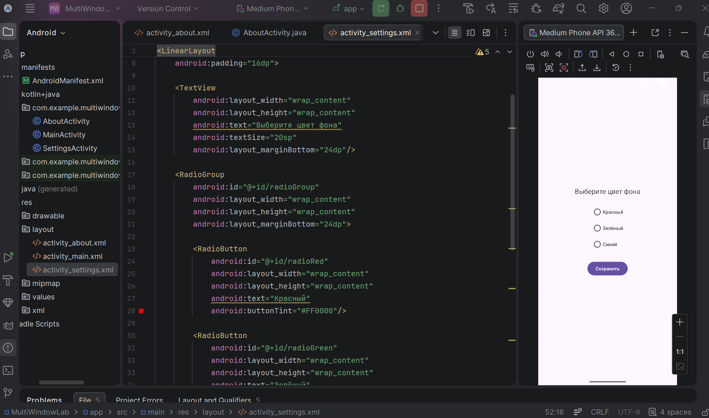

**Рисунок 2** — Интерфейс SettingsActivity

---

### Задание 3. Создание Activity «Об авторе» (AboutActivity)

Создана AboutActivity с информацией об авторе (ФИО, группа) и кнопкой «Назад». Для запуска используется startActivity() без возврата результата.

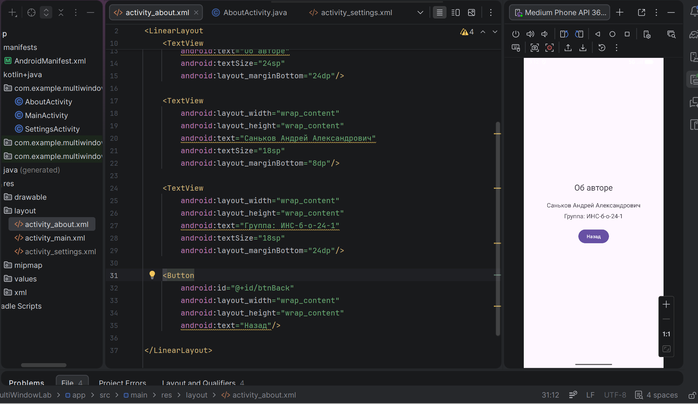

**Рисунок 3** — Интерфейс AboutActivity

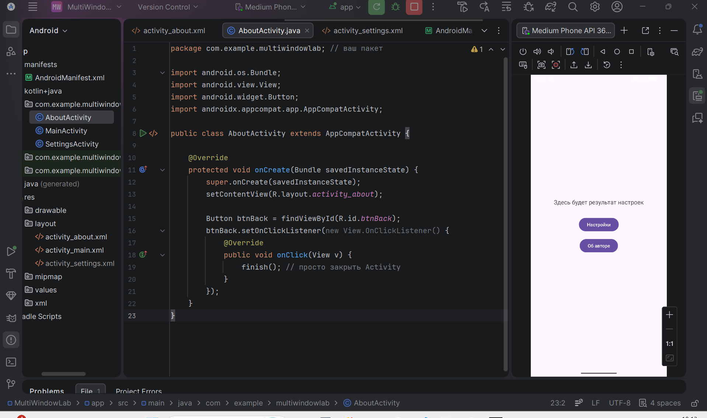

**Рисунок 4** — Логика закрытия Activity

---

### Задание 4. Реализация навигации и получение результата в MainActivity

В MainActivity добавлены обработчики:
- для кнопки «Настройки» — startActivityForResult() с кодом запроса;
- для кнопки «Об авторе» — startActivity().
Переопределён метод onActivityResult(): при получении результата из SettingsActivity изменяется цвет фона главного экрана и выводится сообщение о выбранном цвете.

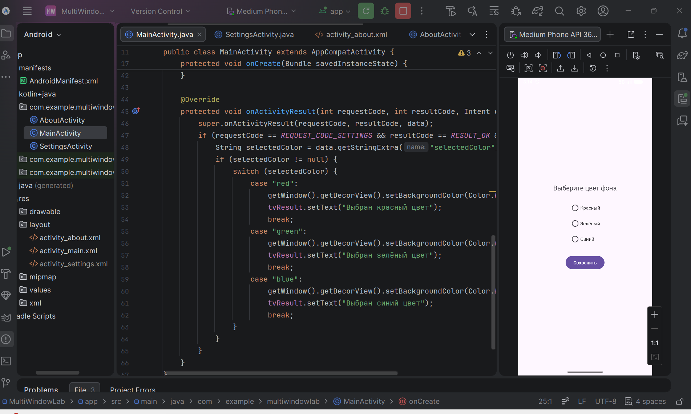

**Рисунок 5** — Код MainActivity (часть)

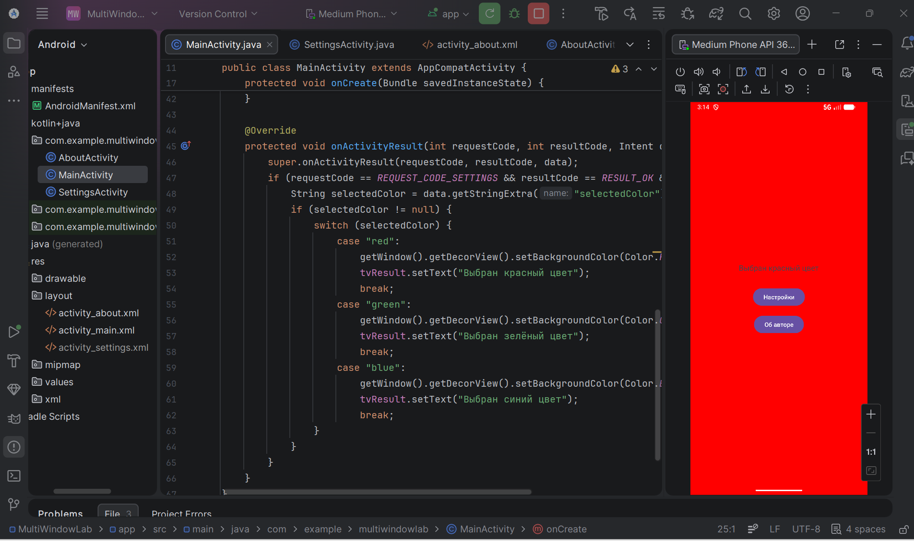

**Рисунок 6** — Главный экран после выбора красного цвета

---

## Задания для самостоятельного выполнения

Выбран **вариант 10: изменение цвета фона на главной странице**. Пользователь может выбрать один из трёх цветов (красный, зелёный, синий) в экране настроек. После нажатия «Сохранить» фон MainActivity меняется соответственно, а в TextView выводится сообщение о выбранном цвете.

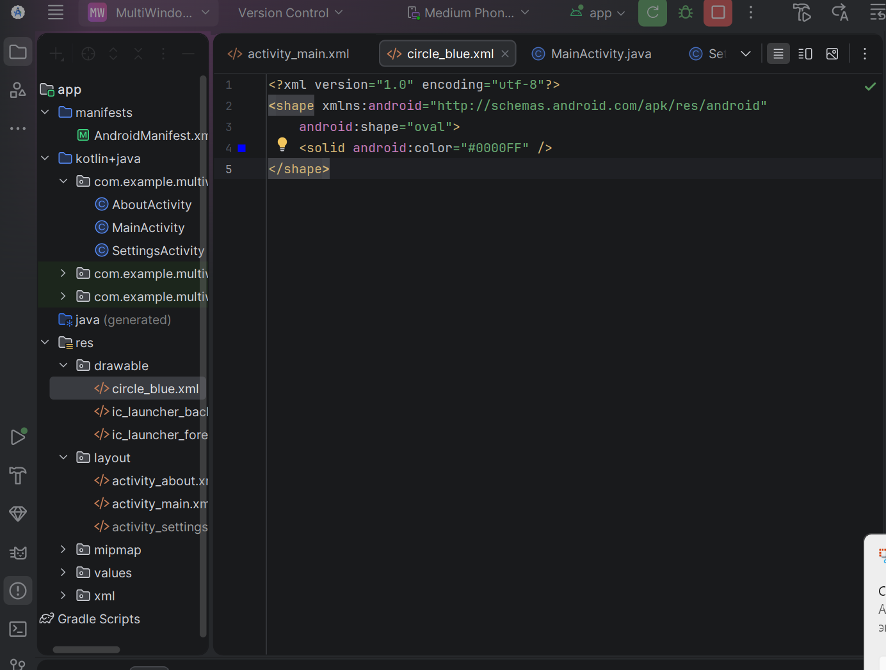

**Рисунок 7** — Создание фигуры(круга) в папке Drawable

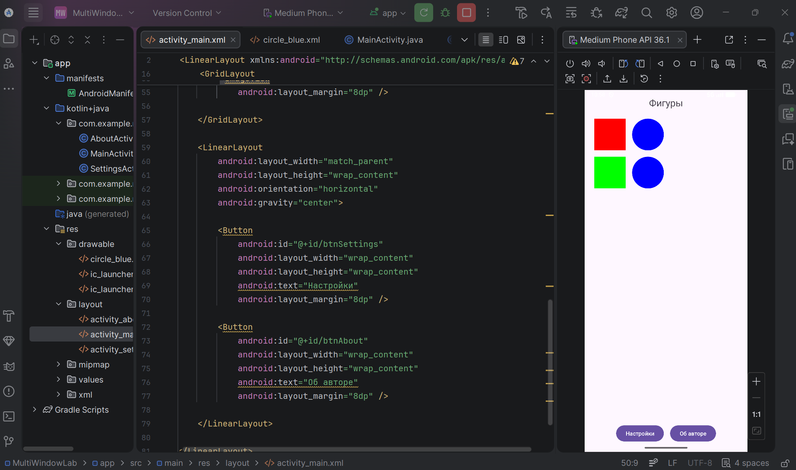

**Рисунок 8** — интерфейс главной вкладки и код файла activity_main.xml

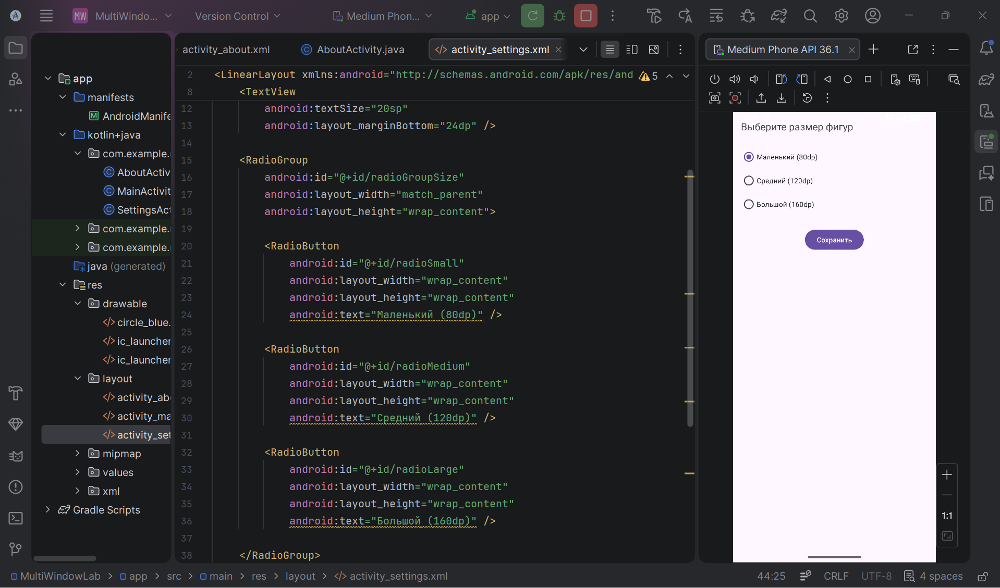

**Рисунок 9** — интерфейс вкладки "настройки" и код файла activity_settings.xml

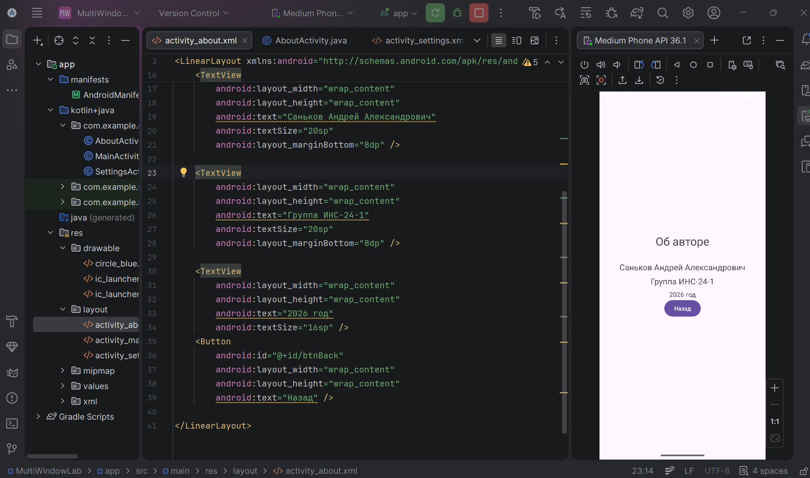

**Рисунок 10** — Интерфейс вкладки "обо мне" и код файла activity_about.xml

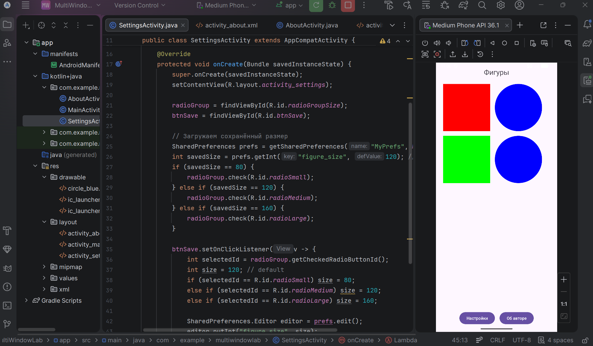

**Рисунок 11** — Пример изменения настроек (увеличение фигур)

---

## Контрольные вопросы

### 1. Что такое Intent? Какие существуют типы Intent (явные и неявные)? Приведите примеры использования каждого типа.

**Intent** — это абстрактное описание операции, которое используется для запуска Activity, сервисов, отправки широковещательных сообщений и передачи данных.

- **Явный (Explicit Intent)** — указывает конкретный класс компонента. Используется внутри приложения.  
  Пример: `Intent intent = new Intent(this, SettingsActivity.class); startActivity(intent);`
- **Неявный (Implicit Intent)** — описывает действие (action) и данные (data), система сама подбирает подходящее приложение.  
  Пример: `Intent intent = new Intent(Intent.ACTION_VIEW, Uri.parse("https://example.com")); startActivity(intent);`

---

### 2. Как передать данные из одной Activity в другую с помощью Intent? Какие ограничения на типы передаваемых данных существуют?

Данные передаются через `putExtra()` (ключ-значение). Принимающая Activity получает их через `getIntent().get...Extra()`.

**Ограничения:** данные должны быть сериализуемыми (примитивы, String, Bundle, объекты, реализующие `Serializable` или `Parcelable`). Не рекомендуется передавать большие объёмы данных (например, изображения) — возможна ошибка `TransactionTooLargeException`.

---

### 3. В чем разница между методами startActivity() и startActivityForResult()? В каких случаях используется каждый из них?

- `startActivity()` — запускает новую Activity, не ожидая результата. Используется, когда обратная связь не нужна.
- `startActivityForResult()` — запускает Activity и ожидает результат. Результат обрабатывается в `onActivityResult()`. Используется, когда нужно получить данные обратно (например, выбор настройки).

---

### 4. Опишите назначение методов setResult() и finish() в контексте возврата данных из дочерней Activity.

- `setResult(int resultCode, Intent data)` — устанавливает код результата и данные, которые будут возвращены вызывающей Activity.
- `finish()` — закрывает текущую Activity. После вызова `finish()` система возвращает управление в родительскую Activity и передаёт установленный результат.

---

### 5. Что произойдёт, если не зарегистрировать Activity в файле AndroidManifest.xml?

При попытке запуска такой Activity возникнет исключение `ActivityNotFoundException`, так как система не найдёт компонент. Все Activity должны быть объявлены в манифесте.

---

### 6. Какие методы жизненного цикла Activity вызываются при переходе от MainActivity к SettingsActivity и при возврате обратно?

**При переходе (Main → Settings):**
1. MainActivity: `onPause()`
2. SettingsActivity: `onCreate()` → `onStart()` → `onResume()`
3. MainActivity: `onStop()`

**При возврате (Settings → Main):**
1. SettingsActivity: `onPause()`
2. MainActivity: `onRestart()` → `onStart()` → `onResume()`
3. SettingsActivity: `onStop()` → `onDestroy()`

---

### 7. Для чего используется requestCode в методе startActivityForResult()? Как обрабатываются несколько различных запросов в onActivityResult()?

`requestCode` — уникальный целочисленный идентификатор запроса. Позволяет различать, какая дочерняя Activity вернула результат, если их несколько. В `onActivityResult()` проверяется `requestCode` (например, через `switch` или `if`), чтобы выполнить соответствующие действия.

```java
if (requestCode == REQUEST_CODE_SETTINGS) {
    // обработка результата настроек
} else if (requestCode == REQUEST_CODE_OTHER) {
    // обработка другого запроса
}
